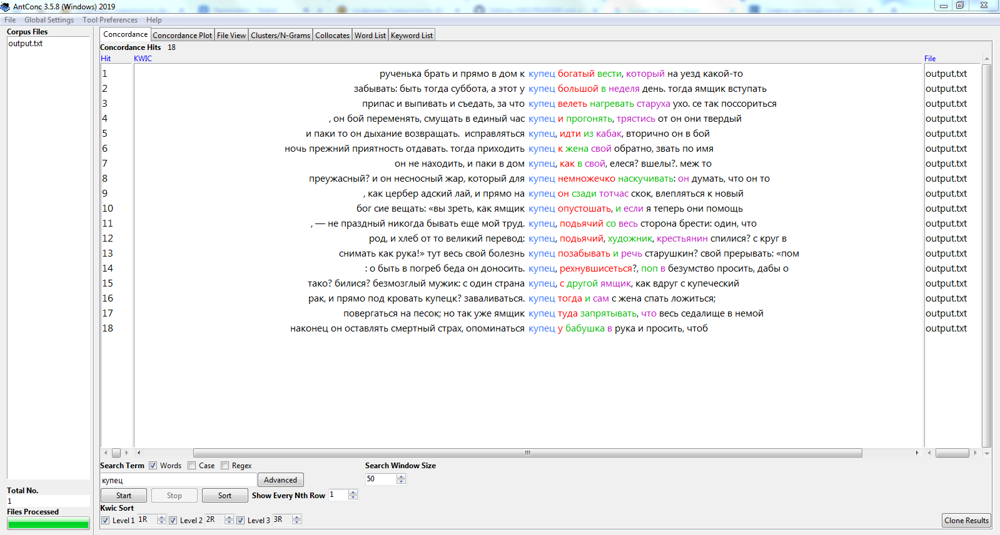
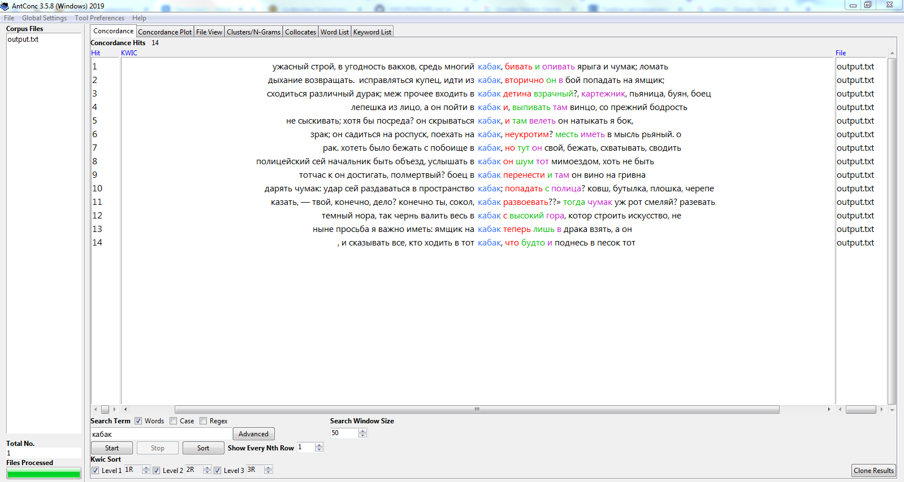
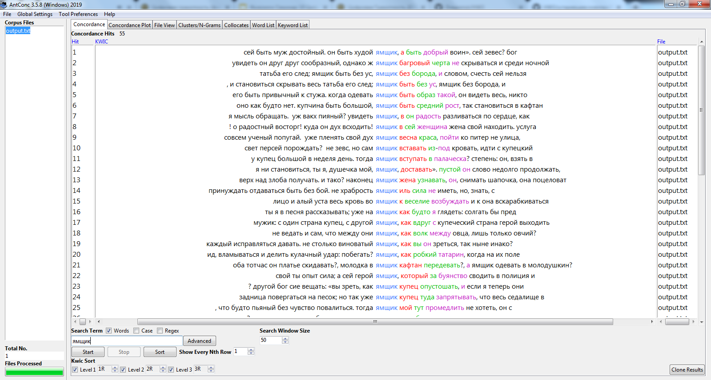

# HW3

I.

1) Устаревшее слово раз

2) Устаревшее слово два

3) Устаревшее слово три

4) N-грамы

5) Коллокаты

II. 

1) 

Что касается "ямщика", я полагаю, лучшим современным синонимом к нему будет "водитель". Куда репрезентантивнее картина использования этих слов во времени показывает НКРЯ, нежели Google Ngrams. Так, в НКРЯ пик использования "ямщика" был в 1796-1799, 1833, 1858, 1864-1865, 1889 и 1901 годы, далее — спад. В 1912 впервые появляется "водитель" и уже к 1951 лидирует в использовании. Google Ngrams даёт почти противоположную картину, когда "водитель" использовался ещё с 1800 и лидировал аж до 1918 года (чего не было в помине у НКРЯ), только примерно в 1956 годах снова завоевав безусловное лидерство. У Google Ngrams пики использования "ямщика" едва заметны — 1782-1784, 1811 и 1837. Кому верить — не очень понятно. У GN и НКРЯ разные базы данных, данные, соответственно, расходятся. 

Примерно то же происходит с кабак-бар и купец-продавец. НКРЯ, как того и следовало ожидать, как "кабак" — безусловный победитель до 1900-ых годов (за исключением "странного" десятилетия 1730-1740-ых), а после "бар" начинает набирать обороты, пока совсем не вытесняет "кабак" в 1960-ых. в Google Ngrams "бар" был лидером всегда (от 1800) и никогда не опускался ниже своего достоинства, прошу прощения, ниже "кабака". С купцом-продавцом абсолютно аналогичная ситуация (в GN "купец" как лидировал с начала 20 века, так и лидирует в 21...). В НКРЯ использование слов эволюционирует, в GN происходит какая-то колдовская мешанина с превалирующими "прямоугольниками" в графиках в 18-19 веках. 

Учитывая, что GN больше специализируется на английском корпусе, а НКРЯ, соответственно, на русском, верить стоит больше НКРЯ, нежели GN, когда исследование включает в себя (особенно устаревшие) слова на русском языке. 

2)

IPM "ямщика" — 1663 / 283 431 966 х 1000000 = 5.876369243735902 ~ 5.9

IPM "кабака" — 1622 / 283 431 966 х 1000000 = 5.722713718183785 ~ 5.7

IPM "купца" — 5 545 / 283 431 966 х 1000000 = 19.56377778503643 ~ 19.6

III. 

Пожалуй, самый полезный инструмент для филолога любого направления — AntConc. Возможно, он не совсем интуитивно понятен, но ужасно многофункционален и действительно может пригодиться при тщательном анализе текста на текстологическом уровне.

Корпус мне мало помог в понимании текста, потому что больно уж на старом наречии поэма написана (1769 год, ничего удивительного), да и прочесть мне её довелось лишь пробежавшись глазами по строкам. Поэзия в целом вещь страшная, а тут ещё и 18 век на 100 страниц, упаси боже...

IPM (items per million) — новый для меня инструмент, вот только полезность его мне кажется достаточно ограниченной. 

Я почти уверена, что филологу-западнику тяжко было бы обойтись лишь НКРЯ (по понятным причинам), поэтому я также ценю введение в Google Ngrams, хоть он и кажется достаточно бесполезным в сравнение с НКРЯ, когда дело доходит до исследования (редких) русских слов в определённом временном промежутке.
